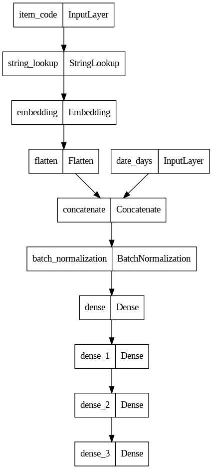
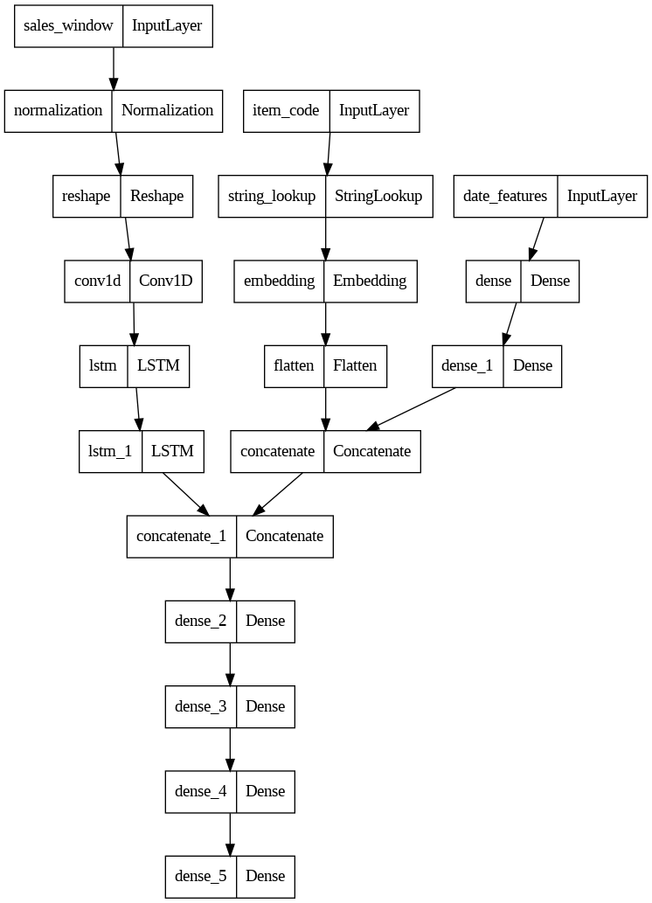

<h2 align="center">Wawasan</h2>

## Built using:
- [Tensorflow](https://www.tensorflow.org/)
- [Google Colab](https://colab.research.google.com/)
- [Google Cloud Platform](https://cloud.google.com/)

## [Models](ml_modelling/models)
### Supplier Schedule Predictor
**Input:**
- *supplier* (string): A string code of the supplier.
- *date features* (float): List of features for date (refer to notebook for more detail).

**Output:**
- *days* (int): Predicted days until supplier will come next.

This is the architecture:

    

### Sales Prediction Model
**Input:**
- *supplier* (string): A string code of the supplier.
- *date features* (float): List of feature for date (refer to notebook for more details).
- *sales_window* (float): List of sales of the last 30 days

**Output:**
  - *quantity* (int): Predicted quantity of the sales for the next day.

  This is the architecture:
  

  
  

  

